### Theory

**Decoder**

In digital electronics, a decoder can take the form of a multiple-input, multiple-output logic circuit that converts coded inputs into coded outputs, where the input and output codes are different e.g. n-to-2n , binary-coded decimal decoders. Decoding is necessary in applications such as data multiplexing, 7 segment display and memory address decoding.

The example decoder circuit would be an AND gate because the output of an AND gate is "High" (1) only when all its inputs are "High". Such output is called as "active High output". If instead of AND gate, the NAND gate is connected the output will be "Low" (0) only when all its inputs are "High". Such output is called as "active low output".

A slightly more complex decoder would be the n-to-2n type binary decoders. These types of decoders are combinational circuits that convert binary information from 'n' coded inputs to a maximum of 2n unique outputs. In case the 'n' bit coded information has unused bit combinations, the decoder may have less than 2n outputs. 2-to-4 decoder, 3-to-8 decoder or 4-to-16 decoder are other examples.

The input to a decoder is parallel binary number and it is used to detect the presence of a particular binary number at the input. The output indicates presence or absence of specific number at the decoder input.

Let us suppose that a logic network has 2 inputs A and B. They will give rise to 4 states A, A', B, B' . The truth table for this decoder is shown below:

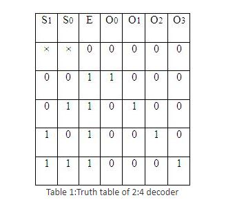

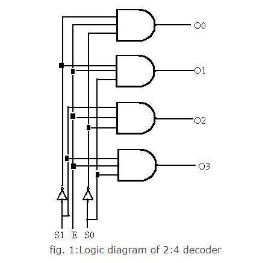

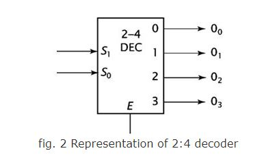

 For any input combination only one of the outputs is low and all others are high. The low value at the output represents the state of the input.

**Decoder expansion**

Combine two or more small decoders with enable inputs to form a larger decoder e.g. 3-to-8-line decoder constructed from two 2-to-4-line decoders.
Decoder with enable input can function as demultiplexer.

**3:8 decoder**

It uses all AND gates, and therefore, the outputs are active- high. For active- low outputs, NAND gates are used. It has 3 input lines and 8 output lines. It is also called as binary to octal decoder it takes a 3-bit binary input code and activates one of the 8(octal) outputs corresponding to that code. The truth table is as follows:

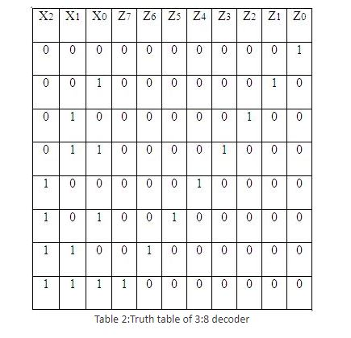

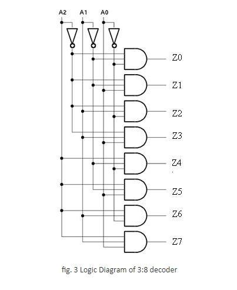

**Encoder**

An encoder is a device, circuit, transducer, software program, algorithm or person that converts information from one format or code to another. The purpose of encoder is standardization, speed, secrecy, security, or saving space by shrinking size. Encoders are combinational logic circuits and they are exactly opposite of decoders. They accept one or more inputs and generate a multibit output code.

Encoders perform exactly reverse operation than decoder. An encoder has M input and N output lines. Out of M input lines only one is activated at a time and produces equivalent code on output N lines. If a device output code has fewer bits than the input code has, the device is usually called an encoder.

**Octal to binary encoder**

Octal-to-Binary take 8 inputs and provides 3 outputs, thus doing the opposite of what the 3-to-8 decoder does. At any one time, only one input line has a value of 1. The figure below shows the truth table of an Octal-to-binary encoder.

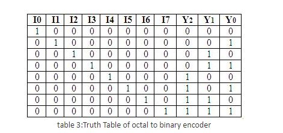

For an 8-to-3 binary encoder with inputs I0-I7 the logic expressions of the outputs Y0-Y2 are:
Y0 = I1 + I3 + I5 + I7
Y1= I2 + I3 + I6 + I7
Y2 = I4 + I5 + I6 +I7

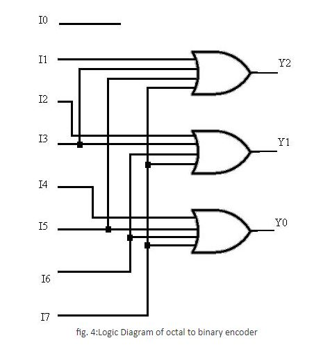

**Priority encoder**

A priority encoder is a circuit or algorithm that compresses multiple binary inputs into a smaller number of outputs. The output of a priority encoder is the binary representation of the ordinal number starting from zero of the most significant input bit. They are often used to control interrupt requests by acting on the highest priority request. It includes priority function. If 2 or more inputs are equal to 1 at the same time, the input having the highest priority will take precedence. Internal hardware will check this condition and priority is set.

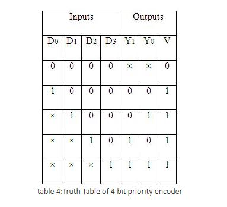

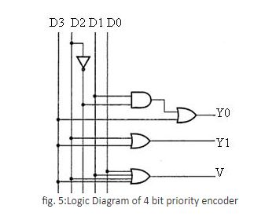

 IC 74148 is an 8-input priority encoder. 74147 is 10:4 priority encoder

  

**Multiplexer**

In electronics, a multiplexer or mux is a device that selects one of several analog or digital input signals and forwards the selected input into a single line. A multiplexer of 2n inputs has n select lines, which are used to select which input line to send to the output. An electronic multiplexer can be considered as a multiple-input, single-output switch i.e. digitally controlled multi-position switch. The digital code applied at the select inputs determines which data inputs will be switched to output.

A common example of multiplexing or sharing occurs when several peripheral devices share a single transmission line or bus to communicate with computer. Each device in succession is allocated a brief time to send and receive data. At any given time, one and only one device is using the line. This is an example of time multiplexing since each device is given a specific time interval to use the line.

In frequency multiplexing, several devices share a common line by transmitting at different frequencies.

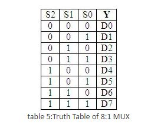
 

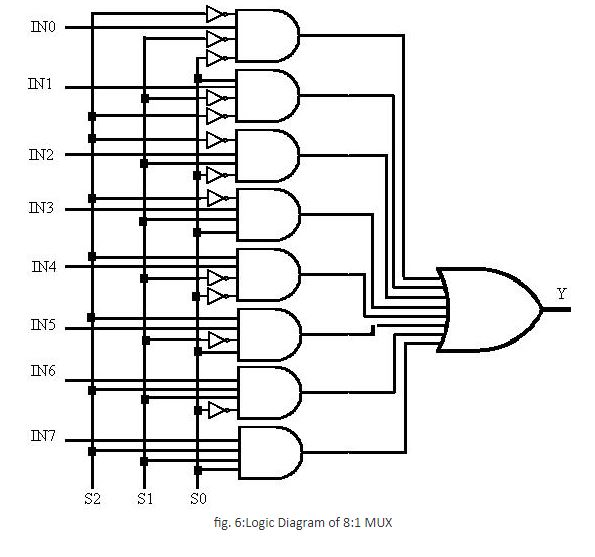

**Demultiplexer**

A demultiplexer (or demux) is a device taking a single input signal and selecting one of many data-output-lines, which is connected to the single input. A multiplexer is often used with a complementary demultiplexer on the receiving end. A demultiplexer is a single-input, multiple-output switch. Demultiplexers take one data input and a number of selection inputs, and they have several outputs. They forward the data input to one of the outputs depending on the values of the selection inputs.

Demultiplexers are sometimes convenient for designing general purpose logic, because if the demultiplexer's input is always true, the demultiplexer acts as a decoder. This means that any function of the selection bits can be constructed by logically OR-ing the correct set of outputs. Demultiplexer is called as a 'distributro', since it transmits the same data to different destinations.

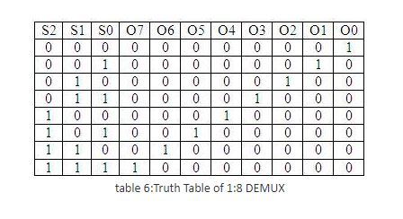

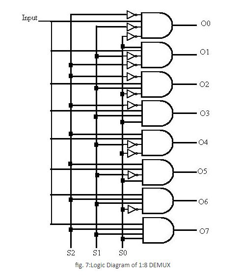

